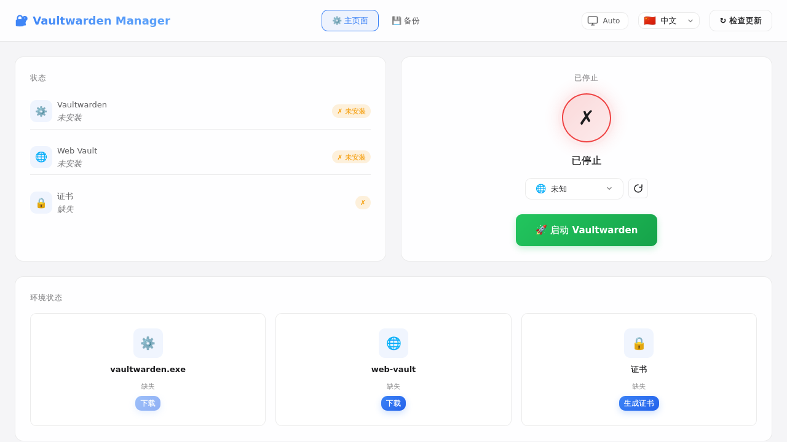
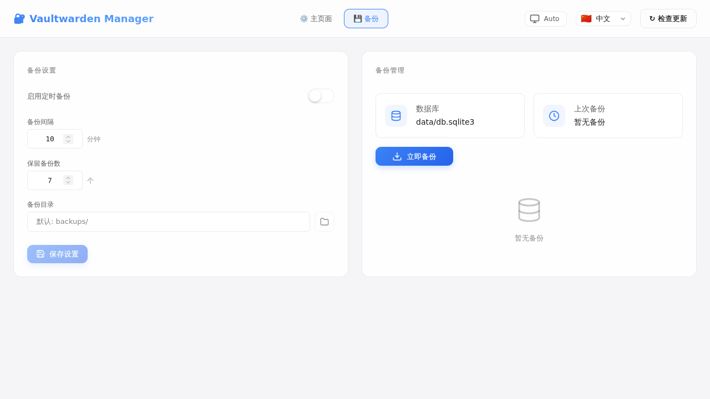

# Vaultwarden Manager / Vaultwarden 管理器

[English](#english) | [中文](#中文)

---

## English

### About

A Vaultwarden management GUI for Windows, built with Tauri 2 + SolidJS.

### Features

- One-click download vaultwarden.exe (from NicholasDewar/Vaultwarden-Windows-Binary)
- One-click download and extract web-vault (from dani-garcia/bw_web_builds)
- One-click generate self-signed certificates (via OpenSSL)
- Configuration management (address, port, domain, TLS)
- Start/Stop vaultwarden service
- Real-time log viewer
- System tray (minimize to tray, tray menu)
- Multi-language (中文/English)
- Auto update check

### Screenshots





### Directory Structure

```
vaultwarden-manager/
├── vaultwarden-gui.exe      ← GUI Manager (build output)
├── vaultwarden.exe          ← Auto downloaded
├── web-vault/               ← Auto downloaded and extracted
│   └── index.html
├── localhost.crt            ← Auto generated
├── localhost.key            ← Auto generated
└── data/                   ← Vaultwarden data
```

### Build (Windows)

#### Prerequisites

1. **Rust**: https://rustup.rs/
2. **Node.js**: https://nodejs.org/
3. **Visual Studio Build Tools** (C++ desktop development)
4. **OpenSSL** (for certificate generation)

#### Build Steps

```batch
cd vaultwarden-manager

:: Install dependencies
npm install

:: Development mode (debug)
npm run tauri dev

:: Production build
npm run tauri build
```

Build output is located at `src-tauri/target/release/vaultwarden-gui.exe`

### Usage

1. Run `vaultwarden-gui.exe`
2. First use will automatically check environment status
3. Click the corresponding button to download/generate required files
4. Configure address, port, domain
5. Click "Start Vaultwarden"
6. Access https://IP:port

### Configuration

| Config | Description | Default |
|--------|-------------|---------|
| Address | Listen address | 0.0.0.0 |
| Port | Listen port | 8443 |
| Domain | Full access URL | https://IP:8443 |
| Enable TLS | Enable HTTPS | true |
| Certificate Path | TLS certificate file | localhost.crt |
| Key Path | TLS key file | localhost.key |
| Data Folder | vaultwarden data directory | data |

### System Tray

- Click close button → Minimize to tray
- Tray menu: Show window, Start/Stop, Check updates, Quit

### Tech Stack

- **Frontend**: SolidJS + TypeScript
- **Backend**: Rust + Tauri 2
- **i18n**: @solid-primitives/i18n
- **Network**: local-ip-address
- **HTTP**: reqwest
- **Archive**: tar + flate2

### Project Structure

```
vaultwarden-manager/
├── src/                    # SolidJS frontend
│   ├── App.tsx
│   ├── components/
│   │   ├── StatusBar.tsx
│   │   ├── EnvironmentPanel.tsx
│   │   ├── ConfigPanel.tsx
│   │   ├── LogViewer.tsx
│   │   └── LanguageSwitcher.tsx
│   ├── stores/
│   │   └── appStore.ts
│   ├── i18n/
│   │   ├── zh.ts
│   │   ├── en.ts
│   │   └── index.tsx
│   └── styles/
│       └── global.css
├── src-tauri/              # Tauri backend (Rust)
│   ├── src/
│   │   ├── main.rs
│   │   ├── lib.rs
│   │   └── commands/
│   │       ├── github.rs   # GitHub API
│   │       ├── process.rs   # Process management
│   │       ├── config.rs    # Config I/O
│   │       ├── ip.rs        # IP detection
│   │       └── logs.rs      # Log management
│   ├── Cargo.toml
│   └── tauri.conf.json
├── package.json
└── vite.config.ts
```

### Notes

- Windows 10/11 only
- Requires WebView2 (built-in on Windows 11, manual install on Windows 10)
- Build must be performed on Windows

---

## 中文

### 关于

基于 Tauri 2 + SolidJS 的 Vaultwarden Windows 图形化管理器。

### 功能特性

- 一键下载 vaultwarden.exe（从 NicholasDewar/Vaultwarden-Windows-Binary）
- 一键下载并解压 web-vault（从 dani-garcia/bw_web_builds）
- 一键生成自签名证书（调用 OpenSSL）
- 配置管理（地址、端口、域名、TLS）
- 启动/停止 vaultwarden 服务
- 实时日志查看
- 系统托盘（最小化到托盘、托盘菜单）
- 多语言（中文/English）
- 自动更新检查

### 截图


### 目录结构

```
vaultwarden-manager/
├── vaultwarden-gui.exe      ← GUI 管理器（构建产物）
├── vaultwarden.exe          ← 自动下载
├── web-vault/               ← 自动下载并解压
│   └── index.html
├── localhost.crt            ← 自动生成
├── localhost.key            ← 自动生成
└── data/                   ← Vaultwarden 数据
```

### 构建（Windows）

#### 前置条件

1. **Rust**: https://rustup.rs/
2. **Node.js**: https://nodejs.org/
3. **Visual Studio Build Tools**（C++ 桌面开发）
4. **OpenSSL**（用于生成证书）

#### 构建步骤

```batch
cd vaultwarden-manager

:: 安装前端依赖
npm install

:: 开发模式（调试）
npm run tauri dev

:: 生产构建
npm run tauri build
```

构建产物位于 `src-tauri/target/release/vaultwarden-gui.exe`

### 使用

1. 运行 `vaultwarden-gui.exe`
2. 首次使用会自动检查环境状态
3. 点击对应按钮下载/生成所需文件
4. 配置地址、端口、域名
5. 点击"启动 Vaultwarden"
6. 访问 https://IP:端口

### 配置说明

| 配置项 | 说明 | 默认值 |
|--------|------|--------|
| 地址 | 监听地址 | 0.0.0.0 |
| 端口 | 监听端口 | 8443 |
| 域名 | 完整访问 URL | https://IP:8443 |
| 启用 TLS | 是否启用 HTTPS | true |
| 证书路径 | TLS 证书文件 | localhost.crt |
| 密钥路径 | TLS 密钥文件 | localhost.key |
| 数据文件夹 | vaultwarden 数据目录 | data |

### 系统托盘

- 点击关闭按钮 → 最小化到托盘
- 托盘菜单：显示主窗口、启动/停止、检查更新、退出

### 技术栈

- **前端**: SolidJS + TypeScript
- **后端**: Rust + Tauri 2
- **i18n**: @solid-primitives/i18n
- **网络接口**: local-ip-address
- **HTTP**: reqwest
- **解压**: tar + flate2

### 项目结构

```
vaultwarden-manager/
├── src/                    # SolidJS 前端
│   ├── App.tsx
│   ├── components/
│   │   ├── StatusBar.tsx
│   │   ├── EnvironmentPanel.tsx
│   │   ├── ConfigPanel.tsx
│   │   ├── LogViewer.tsx
│   │   └── LanguageSwitcher.tsx
│   ├── stores/
│   │   └── appStore.ts
│   ├── i18n/
│   │   ├── zh.ts
│   │   ├── en.ts
│   │   └── index.tsx
│   └── styles/
│       └── global.css
├── src-tauri/              # Tauri 后端 (Rust)
│   ├── src/
│   │   ├── main.rs
│   │   ├── lib.rs
│   │   └── commands/
│   │       ├── github.rs   # GitHub API
│   │       ├── process.rs   # 进程管理
│   │       ├── config.rs    # 配置读写
│   │       ├── ip.rs        # IP 获取
│   │       └── logs.rs      # 日志管理
│   ├── Cargo.toml
│   └── tauri.conf.json
├── package.json
└── vite.config.ts
```

### 注意事项

- 仅支持 Windows 10/11
- 需要 WebView2（Windows 11 自带，Windows 10 需手动安装）
- 构建必须在 Windows 环境下进行
